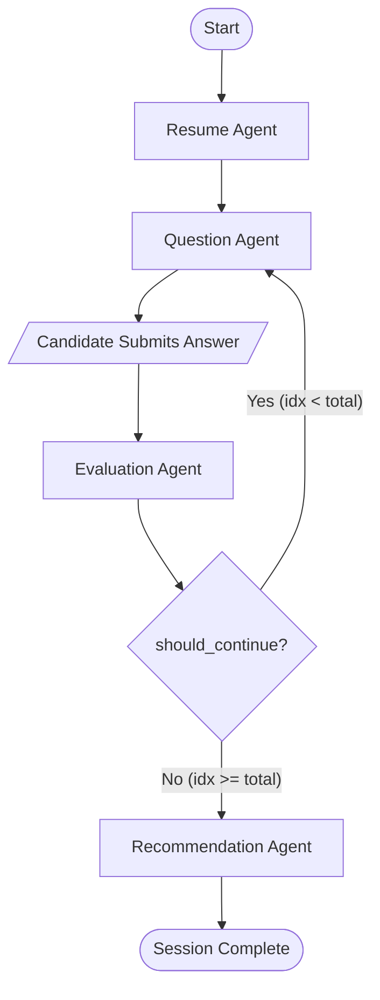

# Multi-Agent LangGraph Orchestration Architecture

## 1. Overview

The **AI Interview Coach** uses **LangGraph** to model the technical interview process as an explicit state machine. Rather than using unstructured linear prompt chains or unpredictable autonomous agent loops, our state machine guarantees:
1. **Deterministic State Transitions**: Clear separation between parsing, questioning, evaluating, and recommending.
2. **Context Persistence**: The full conversational history, candidate profile, and score breakdown are maintained in a strongly-typed state object.
3. **Structured Outputs**: Every agent emits validated Pydantic models with schema fallback parsers.

---

## 2. Multi-Agent Topology & State Graph



---

## 3. Centralized `InterviewState`

All agents read from and mutate a centralized state dictionary defined in `agents/state.py`:

```python
from typing import TypedDict, List, Dict, Any, Optional

class InterviewState(TypedDict):
    session_id: str
    candidate_profile: Dict[str, Any]
    job_profile: Dict[str, Any]
    focus_topics: List[str]
    skill_gaps: List[Dict[str, Any]]
    current_question_index: int
    total_questions: int
    questions: List[Dict[str, Any]]
    answers: List[Dict[str, Any]]
    evaluations: List[Dict[str, Any]]
    readiness_score: float
    recommendations: Dict[str, Any]
    is_completed: bool
```

---

## 4. Agent Node Specifications

### 4.1 Resume Agent (`agents/resume_agent.py`)
- **Responsibility**: Ingests raw candidate resume text and target job description to establish the interview context.
- **Workflow**:
  1. Invokes `nlp.resume_parser.ResumeParser` to extract candidate skills, experience level, and education.
  2. Invokes `nlp.jd_parser.JobDescriptionParser` to extract role requirements and target seniority.
  3. Executes `nlp.matching.SkillGapMatcher` to compute the hybrid fit score and isolate prioritized skill gaps.
  4. Determines primary `focus_topics` (e.g., `["system_design", "cloud_devops"]`) to guide subsequent questioning.

### 4.2 Question Agent (`agents/question_agent.py`)
- **Responsibility**: Generates adaptive technical questions tailored to the candidate's experience tier and identified gaps.
- **Workflow**:
  1. Selects the target domain from `state["focus_topics"]`.
  2. Queries the `FAISSVectorStore` via `rag.retriever.GroundedRetriever` to extract domain-grounded interview standards.
  3. Constructs a system prompt injecting candidate tier, target skill gap, and knowledge base reference chunks.
  4. Calls the configured LLM provider and parses output into an `InterviewQuestion` schema:
     ```json
     {
       "question_id": "q_1",
       "question_text": "How do you prevent cache stampedes in a high-concurrency microservice?",
       "topic": "system_design",
       "difficulty": "Senior",
       "expected_concepts": ["distributed locking", "probabilistic early expiration", "single-flight"]
     }
     ```
  5. Triggers voice synthesis (`AudioSynthesizer`) for spoken audio playback.

### 4.3 Evaluation Agent (`agents/evaluation_agent.py`)
- **Responsibility**: Provides rigorous, multi-criteria assessment of the candidate's spoken or typed answer.
- **Scoring Dimensions** (0.0 to 10.0 scale):
  - **Technical Accuracy**: Correctness of architectural patterns, algorithms, or definitions.
  - **Communication Clarity**: Conciseness, structure, and articulate explanation.
  - **Problem Solving**: Systematic reasoning, trade-off analysis, and edge-case handling.
- **Output Schema (`AnswerEvaluation`)**:
  ```json
  {
    "technical_score": 8.5,
    "communication_score": 9.0,
    "problem_solving_score": 8.0,
    "strengths": ["Solid explanation of mutex locks", "Accurate trade-off comparison"],
    "areas_for_improvement": ["Could mention probabilistic early expiration (XFetch)"],
    "model_answer": "An exemplary response includes...",
    "feedback_summary": "Strong architectural grasp with minor gaps in mitigation algorithms."
  }
  ```

### 4.4 Recommendation Agent (`agents/recommendation_agent.py`)
- **Responsibility**: Synthesizes the overall session results into a tailored preparation roadmap upon interview completion.
- **Workflow**:
  1. Aggregates all question evaluations, computing average scores across all three dimensions.
  2. Invokes the Scikit-Learn readiness classifier (`ml.predictor.ReadinessPredictor`) to assign an objective readiness tier (`Ready`, `Borderline`, `Needs Improvement`).
  3. Synthesizes high-impact focus areas and generates a 4-week structured preparation roadmap.

---

## 5. Conditional Routing & Graph Compilation

The orchestrator (`agents/orchestrator.py`) compiles the state machine using `langgraph.graph.StateGraph`:

```python
from langgraph.graph import StateGraph, END

def should_continue(state: InterviewState) -> str:
    if state["current_question_index"] < state["total_questions"]:
        return "question_agent"
    return "recommendation_agent"

builder = StateGraph(InterviewState)

builder.add_node("resume_agent", resume_node)
builder.add_node("question_agent", question_node)
builder.add_node("evaluation_agent", evaluation_node)
builder.add_node("recommendation_agent", recommendation_node)

builder.set_entry_point("resume_agent")
builder.add_edge("resume_agent", "question_agent")
builder.add_edge("question_agent", "evaluation_agent")
builder.add_conditional_edges("evaluation_agent", should_continue, {
    "question_agent": "question_agent",
    "recommendation_agent": "recommendation_agent"
})
builder.add_edge("recommendation_agent", END)

orchestrator = builder.compile()
```

---

## 6. Resilience, Fallbacks & Testing

1. **Self-Healing Output Parsing**: If an LLM generates invalid JSON (e.g., markdown code fences or conversational prefixes), `llm.structured_output.parse_structured_json` extracts the JSON block using regular expressions and repairs common syntax discrepancies.
2. **Hermetic Local Mock Client**: For local development or environments without API keys, `LocalMockLLMClient` responds deterministically using question templates and semantic heuristics, allowing automated tests and offline users to execute the complete multi-agent cycle with zero failures.
