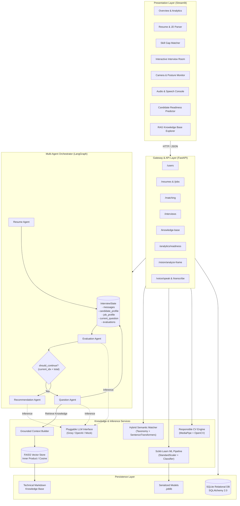
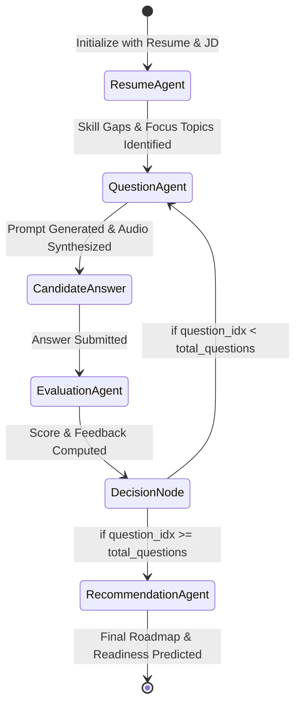

# System Architecture & Technical Design

## 1. Executive Summary

The **AI Interview Coach** is engineered as a modular, decoupled, and production-grade software architecture. It integrates asynchronous REST APIs, multi-agent state orchestration, dense vector retrieval (RAG), machine learning inference pipelines, and non-invasive computer vision edge analytics.

The system is structured into five distinct operational tiers:
1. **Client / Presentation Layer**: Streamlit SaaS dashboard with Plotly visual analytics and media interfaces.
2. **Application & API Gateway**: FastAPI asynchronous server providing contract-validated REST endpoints.
3. **Multi-Agent Orchestration**: LangGraph state machine directing conversational flow, context grounding, and evaluation.
4. **Analytical & Processing Engines**: SentenceTransformers semantic matching, Scikit-Learn readiness inference, and MediaPipe computer vision.
5. **Persistence & Vector Storage**: SQLite relational persistence and FAISS dense vector index.

---

## 2. High-Level Architecture Diagram



---

## 3. Component Deep Dive

### 3.1 Gateway & API Layer (`app/backend/`)
- **FastAPI Core**: Built with asynchronous ASGI request handling, configured CORS middleware, centralized exception handling, and Pydantic v2 data models.
- **Router Segregation**:
  - `/api/v1/health`: System health and service availability checks.
  - `/api/v1/users`: User profile creation and retrieval.
  - `/api/v1/resumes` & `/api/v1/jobs`: File uploads, multipart extraction, and canonical entity parsing.
  - `/api/v1/matching`: Hybrid skill overlap and embedding cosine similarity calculation.
  - `/api/v1/knowledge-base`: Vector index semantic queries and raw document retrieval.
  - `/api/v1/interviews`: Multi-agent session initialization, dynamic question progression, answer submission, and feedback aggregation.
  - `/api/v1/analytics`: Readiness classification, score distributions, and historical trends.
  - `/api/v1/voice` & `/api/v1/vision`: Real-time media endpoints.

### 3.2 NLP & Semantic Matching Engine (`nlp/`)
- **Multi-Format Ingestion**:
  - `pypdf` extracts text from PDF documents.
  - `python-docx` parses Word documents.
  - Regex-driven semantic boundary detection identifies sections (`EXPERIENCE`, `EDUCATION`, `SKILLS`, `PROJECTS`, `CERTIFICATIONS`).
- **Canonical Skill Taxonomy**:
  - Contains over 250 canonical technical entities across 6 disciplines:
    - *Languages*: Python, JavaScript, TypeScript, Go, Rust, Java, C++, etc.
    - *Frameworks*: FastAPI, React, Next.js, Django, Node.js, Spring Boot, etc.
    - *Databases*: PostgreSQL, MongoDB, Redis, Cassandra, SQLite, MySQL, etc.
    - *Cloud & DevOps*: AWS, Docker, Kubernetes, Terraform, CI/CD, Linux, etc.
    - *AI & ML*: PyTorch, TensorFlow, Scikit-Learn, LangChain, Transformers, etc.
    - *System Design*: Microservices, Distributed Systems, Caching, Event-Driven, etc.
  - Case-insensitive regex with word boundary enforcement prevents false matches (e.g., preventing "c" from matching inside "cloud").
- **Hybrid Matching Metric**:
  $$\text{Overall Fit Score} = (0.4 \times \text{Skill Keyword Overlap}) + (0.6 \times \text{Embedding Cosine Similarity})$$
  Embeddings are generated using `sentence-transformers/all-MiniLM-L6-v2` (384-dimensional dense vectors).

### 3.3 Multi-Agent LangGraph State Machine (`agents/`)
The interview workflow operates as a stateful cyclic directed graph:



- **`InterviewState` Schema**:
  ```python
  class InterviewState(TypedDict):
      session_id: str
      candidate_profile: dict
      job_profile: dict
      focus_topics: list[str]
      skill_gaps: list[dict]
      current_question_index: int
      total_questions: int
      questions: list[dict]
      answers: list[dict]
      evaluations: list[dict]
      readiness_score: float
      recommendations: dict
      is_completed: bool
  ```
- **Node Functions**:
  - `ResumeAgent`: Extracts profile vectors, role tier, and prioritized skill gaps.
  - `QuestionAgent`: Queries the FAISS RAG vector store for domain grounding, then prompts the LLM for a targeted question at the candidate's experience tier.
  - `EvaluationAgent`: Assesses answers across Technical Accuracy (0?10), Communication (0?10), and Problem Solving (0?10), returning structured JSON.
  - `RecommendationAgent`: Aggregates all evaluations and synthesizes strengths, weaknesses, and a 4-week structured preparation roadmap.

### 3.4 Grounded RAG Knowledge Base (`rag/`)
- **Document Store**: 7 modular Markdown documents covering modern software engineering and AI disciplines (`data/knowledge_base/`).
- **Chunking Pipeline**: `RecursiveCharacterTextSplitter` splitting on double newlines, headings, and punctuation with `chunk_size=600` characters and `chunk_overlap=100` characters.
- **Vector Store**: Dense FAISS index utilizing normalized Inner Product similarity (mathematically equivalent to Cosine Similarity on unit vectors).
- **Grounded Prompt Assembly**: Injected context includes strict document references, metadata tags, and anti-hallucination instructions.

### 3.5 Scikit-Learn Readiness Engine (`ml/`)
- **Problem Formulation**: Supervised multi-class classification determining interview readiness:
  - Class 0: `Needs Improvement` (requires foundational technical review)
  - Class 1: `Borderline` (marginal competency; needs targeted gap closure)
  - Class 2: `Ready` (consistently exceeds benchmark standards across all criteria)
- **Feature Vector ($X \in \mathbb{R}^6$)**:
  1. `match_score`: Candidate-job semantic fit score ($[0, 100]$)
  2. `avg_technical_score`: Mean score across technical answers ($[0, 10]$)
  3. `avg_communication_score`: Mean score across communication answers ($[0, 10]$)
  4. `avg_problem_solving_score`: Mean score across problem solving answers ($[0, 10]$)
  5. `completion_rate`: Ratio of answered questions to total session questions ($[0, 1]$)
  6. `difficulty_index`: Weighted level of the targeted job role ($1 = \text{Junior}, 2 = \text{Mid}, 3 = \text{Senior}$)
- **Preprocessing Pipeline**: Standardized using `StandardScaler` to achieve zero-mean and unit-variance.
- **Model Implementations**: Evaluates both Regularized Logistic Regression and Random Forest (100 estimators), persisting the highest-performing model via `joblib`.

### 3.6 Responsible Computer Vision & Audio Module (`vision/`, `voice/`)
- **Non-Invasive Visual Metrics**:
  - Utilizes Google MediaPipe Pose and FaceMesh for physical geometry tracking.
  - Calculates horizontal and vertical head tilt angles from 3D facial landmark landmarks (nose tip, chin, lateral eye corners).
  - Measures shoulder tilt angle and spine alignment stability.
  - Computes inter-frame optical motion energy to detect excessive camera shake or movement.
- **Ethical & Regulatory Safeguards**:
  - The module **never** infers emotions, psychological states, nervous anxiety, honesty, or cultural micro-expressions.
  - Metrics are strictly technical: "Is the candidate centered in frame? Is lighting adequate? Is camera movement stable?"
- **Speech Interfaces**:
  - Text-to-Speech: Synthesizes question audio via `gTTS` with an autonomous fallback that generates pure-Python synthetic PCM WAV audio files.
  - Speech-to-Text: OpenAI Whisper integration with graceful text input fallbacks.

---

## 4. Data Flow: Complete Interview Lifecycle

```
[Candidate] ---> Uploads Resume & Pastes JD ---> [Streamlit UI]
                                                       |
                                                       v
                                            [FastAPI /matching]
                                                       |
                                  +--------------------+--------------------+
                                  |                                         |
                                  v                                         v
                         [Skill Extractor]                      [SentenceTransformers]
                                  |                                         |
                                  +--------------------+--------------------+
                                                       |
                                                       v
                                            [Skill Gap Analysis]
                                                       |
                                                       v
                                            [LangGraph Interview]
                                                       |
   +---------------------------------------------------+---------------------------------------------------+
   |                                                   |                                                   |
   v                                                   v                                                   v
[Question Agent]                              [Evaluation Agent]                                  [ML Readiness]
- RAG FAISS Lookup                            - Multi-Criteria Scoring                            - Feature Normalization
- Grounded Prompting                          - Constructive Feedback                             - Readiness Class (Ready)
- gTTS Speech Synthesis                       - SQLite Persistence                                - Probability Distribution
   |                                                   |                                                   |
   +---------------------------------------------------+---------------------------------------------------+
                                                       |
                                                       v
                                            [Recommendation Agent]
                                                       |
                                                       v
                                            [Interactive Analytics]
```

---

## 5. Security, Reliability & Production Readiness

1. **Deterministic Local Fallback**: When external LLM API keys (`GROQ_API_KEY`, `OPENAI_API_KEY`) are omitted or offline, the system automatically falls back to `LocalMockLLMClient`, generating context-grounded structured outputs with zero runtime failures.
2. **Schema Validation**: All API inputs and LLM outputs are strictly validated via Pydantic models. Malformed JSON outputs from LLMs are automatically sanitized through self-healing regex parsers.
3. **Database Concurrency**: SQLAlchemy with connection pooling and thread-safe session contexts ensures safe multi-session access.
4. **Data Privacy**: All resume text and video frames are processed transiently in memory or in isolated temporary media directories without persistent video storage.
