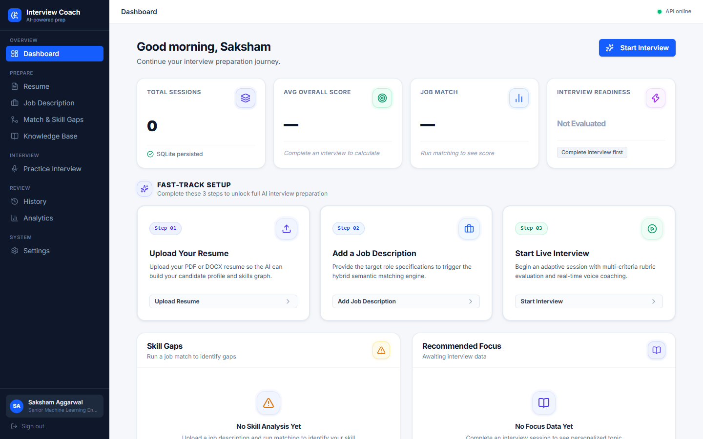
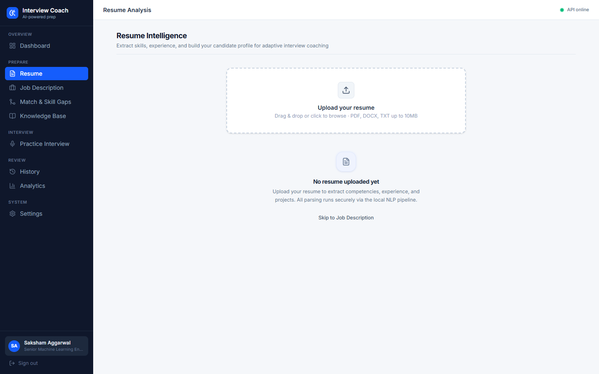
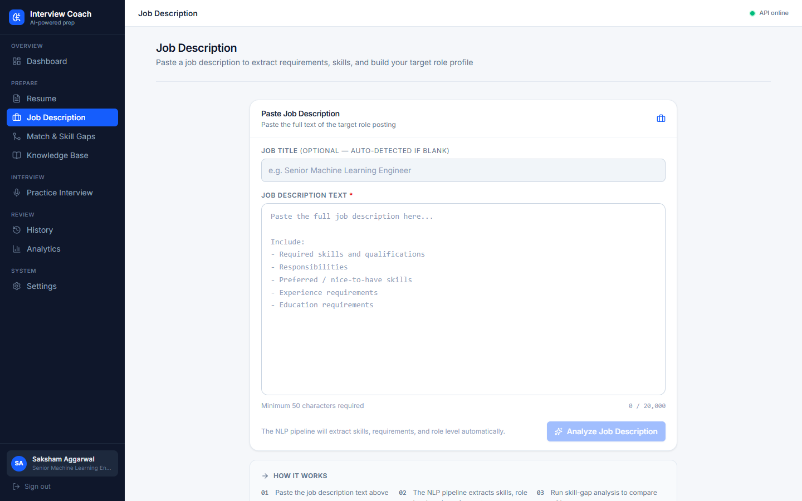
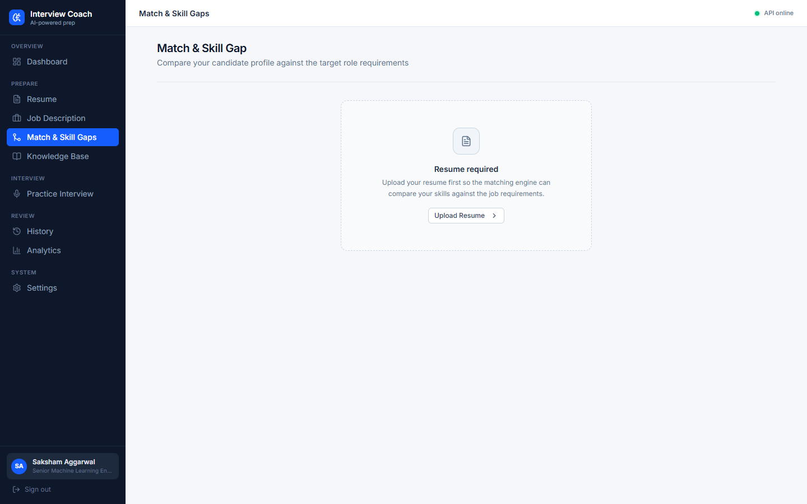
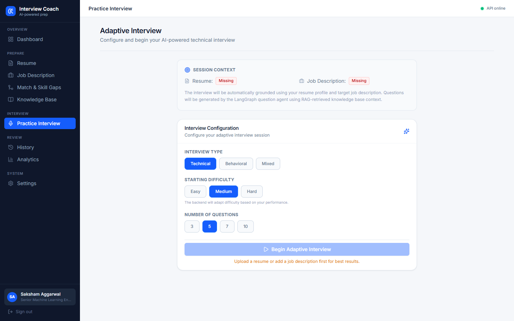
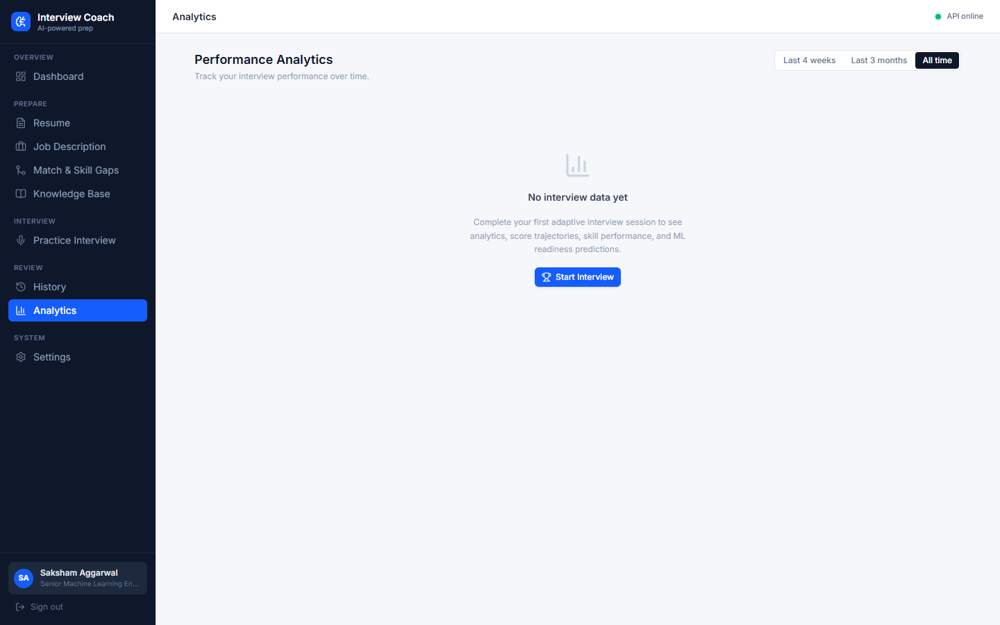
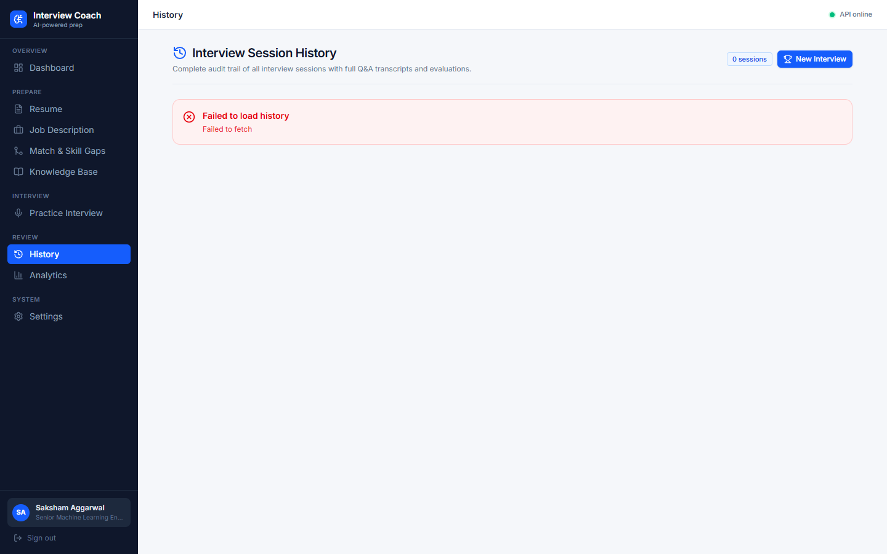

# 🤖 AI Interview Coach — Feature Showcase

> **Live Demo**: [ai-interview-coach-frontend-687t.onrender.com](https://ai-interview-coach-frontend-687t.onrender.com)
> **Backend API**: [ai-interview-coach-zb5e.onrender.com/docs](https://ai-interview-coach-zb5e.onrender.com/docs)

A production-deployed, full-stack AI platform for adaptive technical interview coaching. Built end-to-end with LangGraph multi-agent orchestration, FAISS RAG retrieval, Scikit-Learn ML, voice I/O, and a modern Next.js frontend — all running live on Render free tier.

---

## 🏗️ System Architecture

```
┌─────────────────────────────────────────────────────────────┐
│                    Next.js Frontend                         │
│         (Render Static · ai-interview-coach-frontend)       │
└──────────────────────┬──────────────────────────────────────┘
                       │  /api/py/* reverse proxy
┌──────────────────────▼──────────────────────────────────────┐
│                   FastAPI Backend                           │
│          (Render Free · Docker · Oregon region)            │
│                                                             │
│  LangGraph State Machine:                                   │
│  ResumeAgent → QuestionAgent ⇄ EvaluationAgent → RecAgent  │
│                                                             │
│  FAISS Vector Store · Scikit-Learn ML · SQLite DB          │
│  NLP Parsers · Voice I/O · Skill Gap Matcher               │
└─────────────────────────────────────────────────────────────┘
```

---

## 📸 Screenshots

### 🏠 Dashboard


The central hub — personalized greeting, 4 live KPI cards, Fast-Track Setup guide, Skill Gaps, Recommended Focus.

---

### 📄 Resume Upload & Parsing


Drag-and-drop PDF/DOCX upload. AI extracts full candidate profile: skills, experience, education, projects, certifications.

---

### 💼 Job Description Analyzer


Paste any job posting. NLP extracts required/preferred skills, technologies, responsibilities, and ATS keywords.

---

### 🔗 Skill Matching Engine


Hybrid semantic match between your resume and the JD. Shows match %, gap report (High/Medium/Low priority), and study paths.

---

### 🎤 Live Interview Session


Full LangGraph multi-agent interview. Voice + text input, FAISS RAG questions, real-time 5-dimension AI evaluation.

---

### 📊 Analytics


Score trend charts, topic mastery breakdown, performance dimensions, and ML readiness classifier results.

---

### 🕒 Interview History


Full archive of all sessions with per-question Q&A drill-down, AI feedback, strengths, and weaknesses.

---

## 📄 Pages & Features

### 🏠 Dashboard (`/`)

**4 Live KPI Cards**
| Card | What it shows |
|------|--------------|
| 🟣 Total Sessions | All interviews started (SQLite-persisted) |
| 🟢 Avg Overall Score | Mean % across completed sessions + progress bar |
| 🔵 Job Match | Semantic fit % against target role |
| 🟡 Interview Readiness | ML classifier tier + Scikit-Learn confidence score |

**Performance Charts** *(appear after first session)*
- 📈 Score Trajectory — Line chart across all sessions
- 📊 Topic Mastery — Horizontal bar chart, color-coded by domain
- 🎯 Performance Dimensions — 5-axis progress bars (Technical · Communication · Relevance · Completeness · Clarity)

**Smart Cards**
- ⚠️ Skill Gaps — High-priority + missing skills from JD analysis
- 📖 Recommended Focus — Weak areas + confirmed strengths
- 🕒 Recent Sessions — Last 5 sessions table

---

### 📄 Resume Upload & Parsing (`/resume`)

- Drag-and-drop PDF / DOCX upload
- AI-extracted profile: name, contact, skills, experience, education, projects, certifications
- Experience tier classification: Junior / Mid / Senior
- Cold-start aware error messages

---

### 💼 Job Description Analyzer (`/jobs`)

Paste any job posting — NLP extracts:
- Required + preferred skills
- Technologies, responsibilities, education requirements
- ATS keywords, role level, seniority

---

### 🔗 Skill Matching Engine (`/matching`)

Hybrid semantic match between your resume and the target JD:
- Overall match % (composite score)
- Required skills coverage, preferred skills coverage
- SentenceTransformer cosine semantic similarity
- Experience & education alignment
- Gap report: Strong · Matched · Partial · Missing (High/Medium/Low priority)
- Study path recommendations per gap

---

### 🎤 Live Interview Session (`/interview`)

Full LangGraph multi-agent interview engine:

**Setup**: Target role · Interview type · Difficulty · Question count

**During Interview**
- Questions generated via FAISS RAG retrieval (7 technical domains)
- 🎙️ Voice input (Web Speech API) + ⌨️ text fallback
- 🔊 Voice output (TTS question playback)
- Real-time progress bar + skip option

**Per-Question AI Evaluation (5 dimensions)**
| Dimension | Scale |
|-----------|-------|
| 🔬 Technical Accuracy | 0–100 |
| 🎯 Relevance | 0–100 |
| 📋 Completeness | 0–100 |
| 💬 Clarity | 0–100 |
| 🗣️ Communication | 0–100 |

Plus: Strengths · Weaknesses · Missing Concepts · Feedback · Next difficulty adjustment

**Session Complete**
- Final score + ML readiness tier
- Learning priorities + practice questions
- 4-week preparation roadmap

---

### 📊 Analytics (`/analytics`)

- Score trend line chart, topic bar chart, readiness pie chart
- Average scores across all 5 evaluation dimensions
- ML readiness classifier score + model architecture label
- Strong vs. weak topic identification

---

### 🕒 Interview History (`/history`)

- Full archive of all sessions
- Per-question drill-down: question, answer, 5-dimension scores, AI feedback
- Strengths · Weaknesses · Missing Concepts · Recommended follow-up topics

---

## ⚡ Technical Highlights

| Capability | Implementation |
|-----------|---------------|
| Multi-Agent Orchestration | LangGraph `StateGraph` with typed `InterviewState` |
| RAG Retrieval | FAISS CPU · 100% Top-1 accuracy · 96.7% Recall@3 |
| Structured LLM Output | Pydantic schemas + JSON repair fallback |
| ML Readiness Classifier | Scikit-Learn · 97.23% macro F1 · 97.92% test accuracy |
| Voice I/O | Web Speech API (STT) + gTTS (TTS) |
| Cold-Start UX | 4-state header: connecting → waking → online → offline |
| Session Persistence | SQLite with full Q&A, scores, evaluations |
| RAM Optimization | CPU-only PyTorch · lazy MediaPipe · fits 512MB Render |
| LLM Providers | Groq (llama-3.1-70b) · OpenAI (gpt-4o-mini) · LocalMockClient |

---

## 🗺️ Navigation Map

```
/               ── Dashboard
├── /resume     ── Resume upload + AI parsing
├── /jobs       ── Job description analyzer
├── /matching   ── Semantic skill matching + gap report
├── /interview  ── Live adaptive interview (voice + text)
├── /analytics  ── Performance analytics + ML readiness
├── /history    ── Session history + Q&A review
├── /knowledge  ── Knowledge base explorer
├── /settings   ── User settings
└── /login      ── Authentication
```

---

## 🚀 Live Deployment

| Service | URL |
|---------|-----|
| Frontend | https://ai-interview-coach-frontend-687t.onrender.com |
| Backend API | https://ai-interview-coach-zb5e.onrender.com |
| Swagger Docs | https://ai-interview-coach-zb5e.onrender.com/docs |
