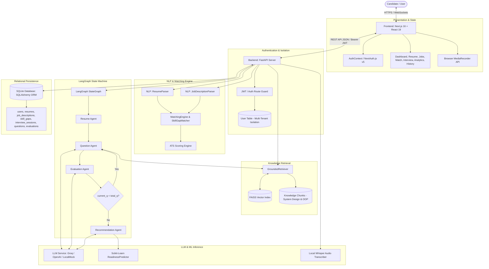

# AI Interview Coach — Architecture Specification

## 1. End-to-End System Topology

## 2. Component Implementation Status Matrix

| Layer / Component | Technology | Implementation Status | Notes |
|---|---|:---:|---|
| **Web Frontend** | Next.js 16 + Tailwind | **Implemented** | 13 compiled routes, dark-navy compact SaaS layout |
| **Authentication** | NextAuth.js v5 + Google OAuth | **Implemented** | HttpOnly JWT session cookies, DB user resolution |
| **Resume Parser** | Rule/regex + Tokenizer | **Implemented** | Line-by-line project boundary classifier, extracts 2 projects |
| **JD Parser** | Regex & Entity Extractor | **Implemented** | Extracts title, experience level, required & preferred skills |
| **Hybrid Fit Matcher** | Set overlap + Jaccard | **Implemented** | Categorizes skills: Strong, Matched, Partial, Missing |
| **ATS Scoring Engine** | 6-Component weighted formula | **Implemented** | 0–100 score, letter grade, keyword breakdown, recommendations |
| **Knowledge Base / RAG** | FAISS + Sentence Embeddings | **Implemented** | Ingests engineering markdown chunks, L2 distance vector search |
| **Multi-Agent Flow** | LangGraph StateGraph | **Implemented** | Explicit state dictionary, deterministic transitions, adaptive follow-ups |
| **Answer Evaluation** | Multi-criteria 5-Axis rubric | **Implemented** | Accuracy, Relevance, Completeness, Clarity, Communication |
| **Readiness Prediction** | Scikit-Learn Classifier | **Implemented** | Predicts Readiness Tier + probabilities from session features |
| **Speech-to-Text (STT)** | OpenAI Whisper (Local) | **Implemented** | Fallback-guarded transcription, rejects empty/silent audio |
| **Computer Vision (CV)** | Webcam Pose / MediaPipe | *Deferred* | Intentionally excluded per project scope constraints |
| **Cloud Vector Service** | Pinecone / Qdrant | *Planned* | Local FAISS currently used for zero external cloud dependency |

## 3. Data Flow Architecture

1. **Authentication Flow**:
   User initiates login via `/login` $	o$ NextAuth Google OAuth handler sets HttpOnly JWT cookie $	o$ Frontend `AuthContext` requests `/api/py/auth/me` $	o$ Backend decodes token, resolves/creates user in SQLite `users` table $	o$ all subsequent API requests carry user scope.
2. **Resume & JD Ingestion Flow**:
   User uploads PDF to `POST /resumes/upload` $	o$ `pdfplumber` extracts raw text $	o$ `nlp.resume_parser` categorizes skills, education, and project blocks $	o$ JSON persisted in `resumes.parsed_profile`. Same pipeline parses JD via `POST /jobs/analyze`.
3. **Interview Execution Flow**:
   `POST /interviews/start` initializes an `InterviewSession` with `total_questions=3` $	o$ `QuestionAgent` retrieves context chunks from `FAISSVectorStore` $	o$ question returned to candidate. Candidate submits answer via `POST /interviews/{id}/answer` $	o$ `EvaluationAgent` scores answer on 5 dimensions and determines next difficulty $	o$ `POST /interviews/{id}/next` advances turn or invokes `RecommendationAgent` $	o$ `ReadinessPredictor` calculates final readiness tier.
