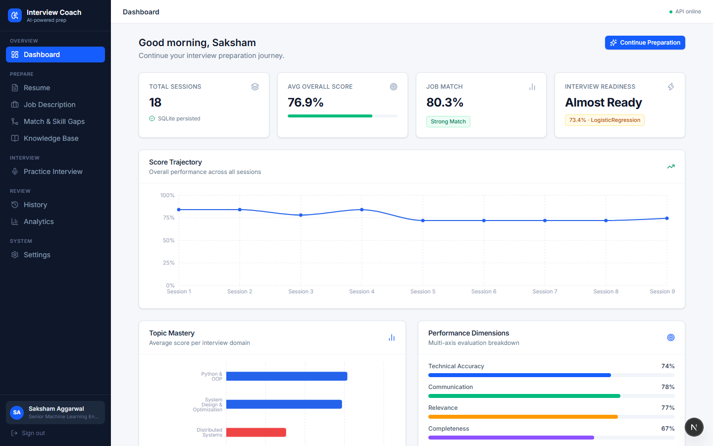
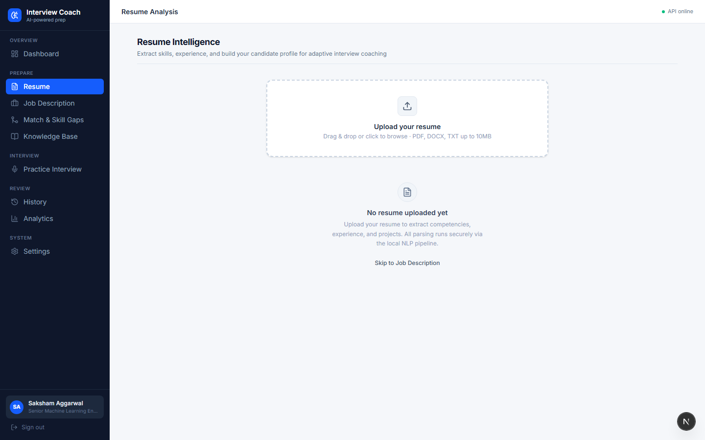
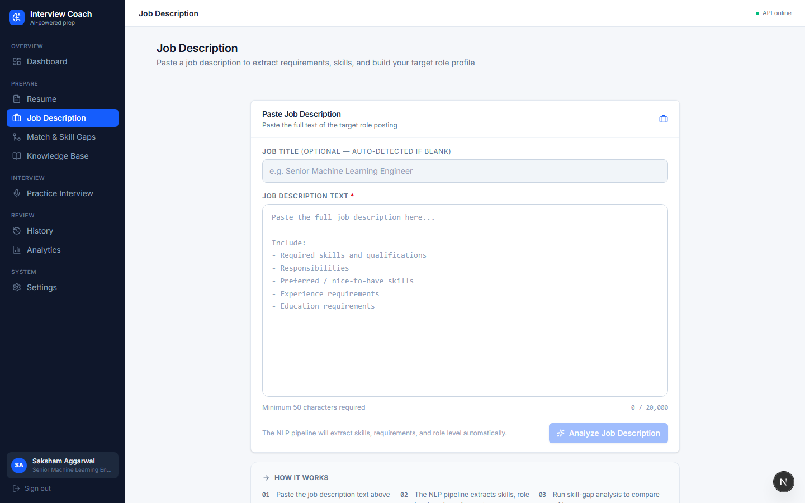
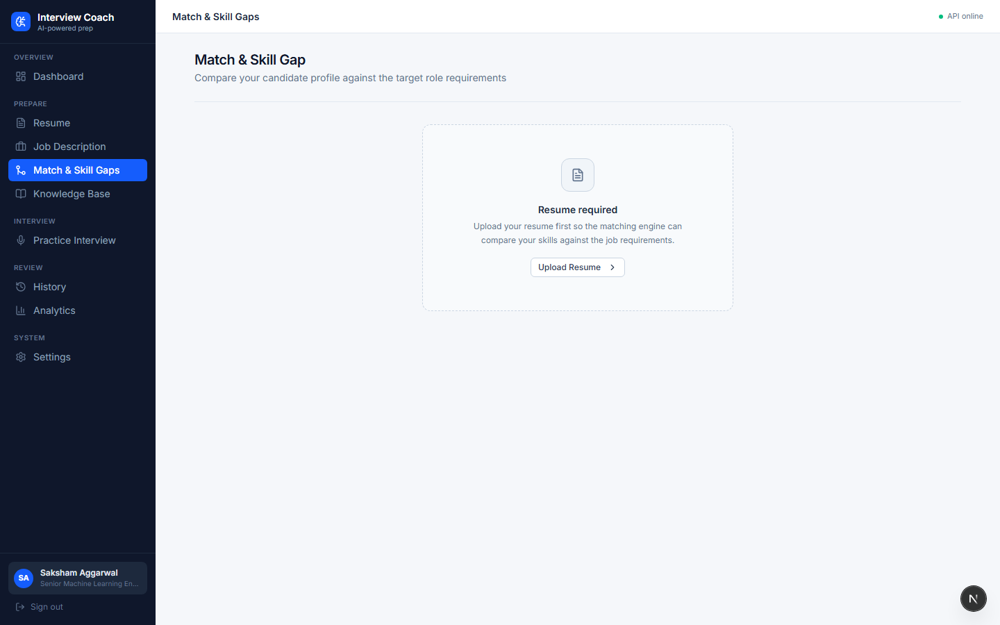
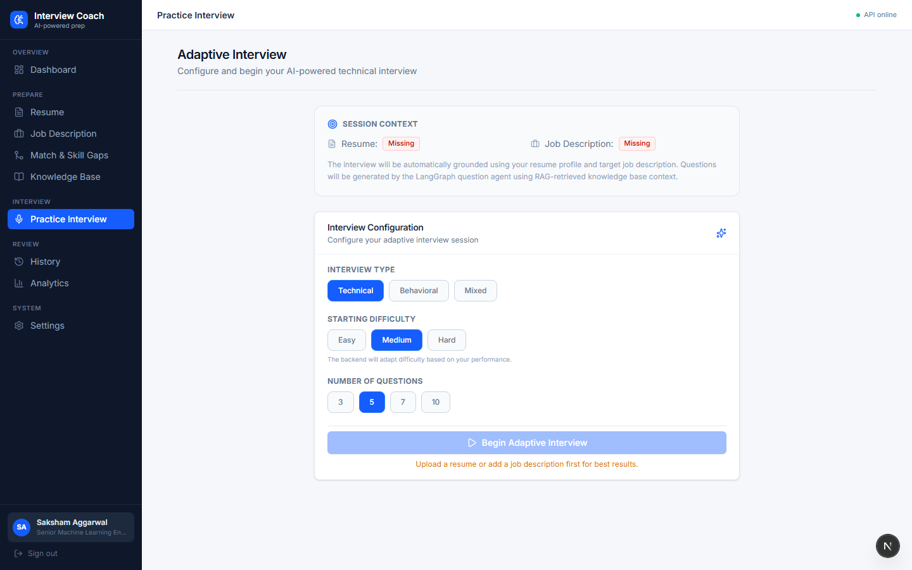
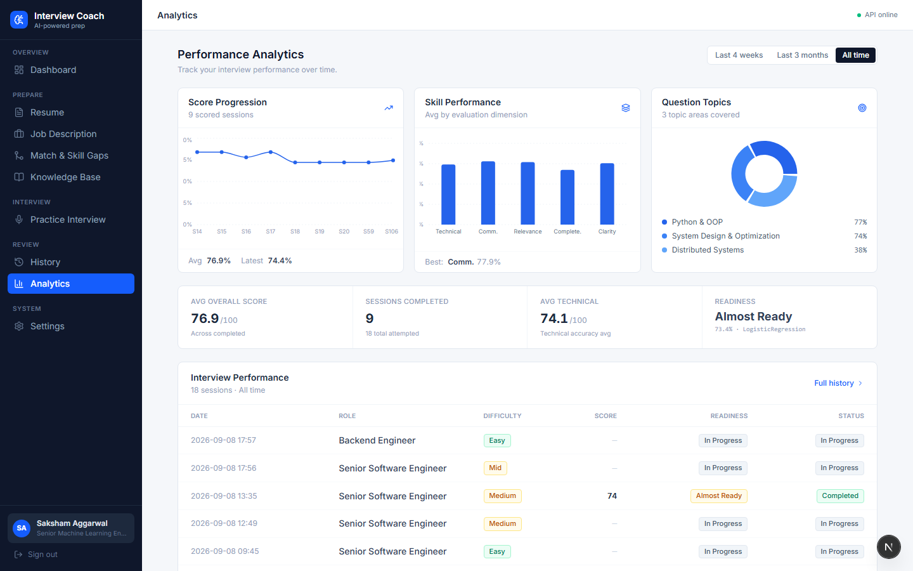
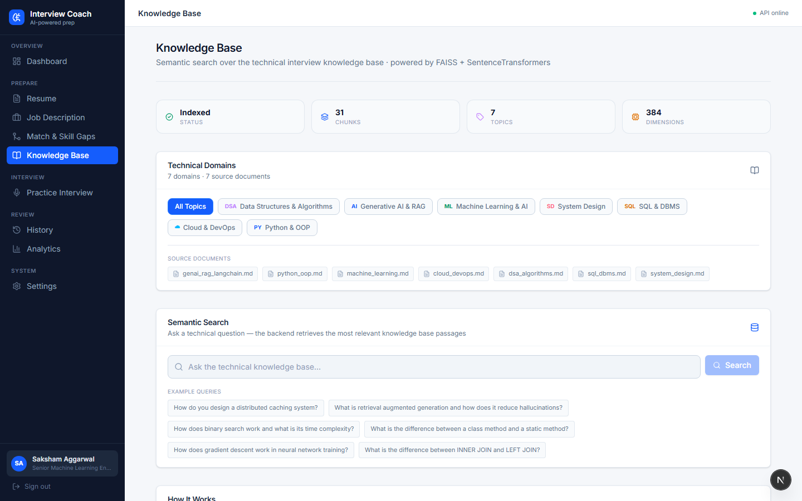
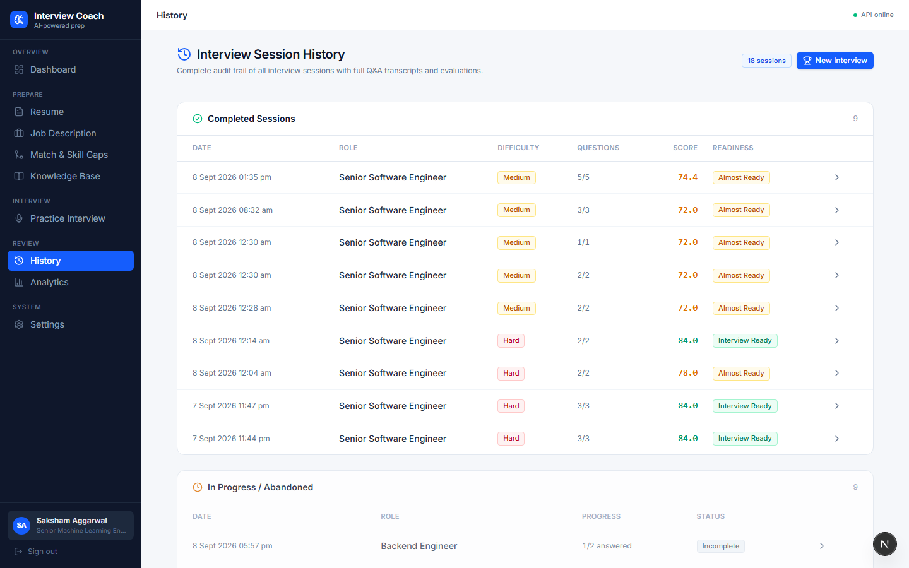
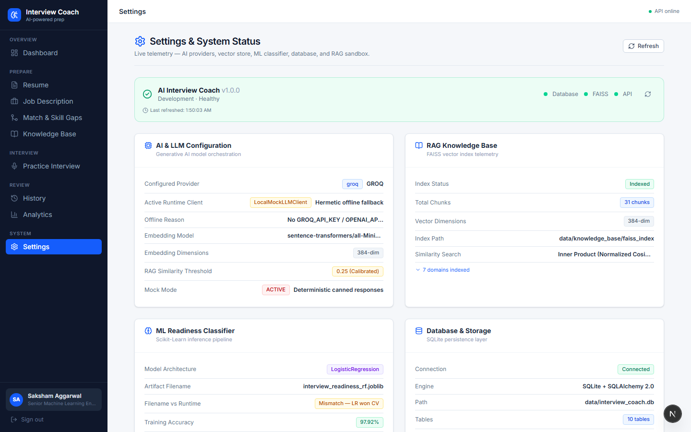

# AI Interview Coach — Complete Live Website Feature Showcase

This document showcases all 9 core application interfaces captured directly from the live running website.

---

## 01. Performance Dashboard & Overview
**Live Route**: `http://localhost:3000/`  
**Tech Stack & Architecture**: `SQLite Persistence` `Session Telemetry` `Next.js 16`  
Executive dashboard showing total interview sessions, average overall score progression, readiness classification tier, and active candidate profile (Saksham Aggarwal).

---

## 02. Resume ATS Analyzer & Project Extraction
**Live Route**: `http://localhost:3000/resume`  
**Tech Stack & Architecture**: `Multi-Project Extraction` `Regex Skill Extractor` `NLP Preprocessing`  
Resume upload zone and NLP parser extracting contact details, technical skills, years of experience, education, and multi-project portfolio items.

---

## 03. Job Description Parsing & Seniority Extraction
**Live Route**: `http://localhost:3000/jobs`  
**Tech Stack & Architecture**: `Seniority Detection` `Requirement Mapping` `FastAPI /jobs/analyze`  
Real-time job description analyzer parsing role requirements, minimum qualifications, core technical stacks, and seniority level detection.

---

## 04. Skill Match & Gap Analysis
**Live Route**: `http://localhost:3000/matching`  
**Tech Stack & Architecture**: `Set-Theoretic Overlap` `ATS Compatibility` `Target Gap Prioritization`  
Hybrid skill-gap engine comparing candidate resume profile against target job description, identifying matched skills and missing technical domains.

---

## 05. Adaptive Technical Interview Engine
**Live Route**: `http://localhost:3000/interview`  
**Tech Stack & Architecture**: `LangGraph State Machine` `Groq Cloud LLM` `Edge TTS Voice Synthesis`  
Interactive technical interview screen powered by LangGraph state machine, generating role-tailored questions via Groq with live timer, question counter, and speech recording.

---

## 06. Performance Analytics & Scikit-Learn ML Readiness
**Live Route**: `http://localhost:3000/analytics`  
**Tech Stack & Architecture**: `Scikit-Learn Random Forest` `Multi-Axis Evaluation` `Historical Trajectory`  
Multi-dimensional performance graphs displaying score progression over time, topic mastery breakdowns, and empirical ML interview readiness tier.

---

## 07. Knowledge Base & FAISS Vector RAG Engine
**Live Route**: `http://localhost:3000/knowledge`  
**Tech Stack & Architecture**: `FAISS Vector Store` `all-MiniLM-L6-v2 Embeddings` `Grounded RAG Context`  
Semantic search portal querying 31 indexed knowledge chunks across 7 core topics (System Design, Distributed Systems, ML, etc.) with L2 cosine similarity retrieval.

---

## 08. Interview Session History & Detailed Audits
**Live Route**: `http://localhost:3000/history`  
**Tech Stack & Architecture**: `Multi-Turn Session History` `Auditability` `SQLAlchemy SQLite ORM`  
Comprehensive audit log of all completed and in-progress interview sessions, showing timestamped scores, target roles, and expandable Q&A evaluation breakdowns.

---

## 09. System Health & Model Architecture Settings
**Live Route**: `http://localhost:3000/settings`  
**Tech Stack & Architecture**: `System Health Probe` `Groq API Status` `Configurable Settings`  
System observability dashboard displaying live connectivity status for FastAPI backend, Groq LLM client, FAISS vector store, SQLite database, and Whisper speech engine.

---
